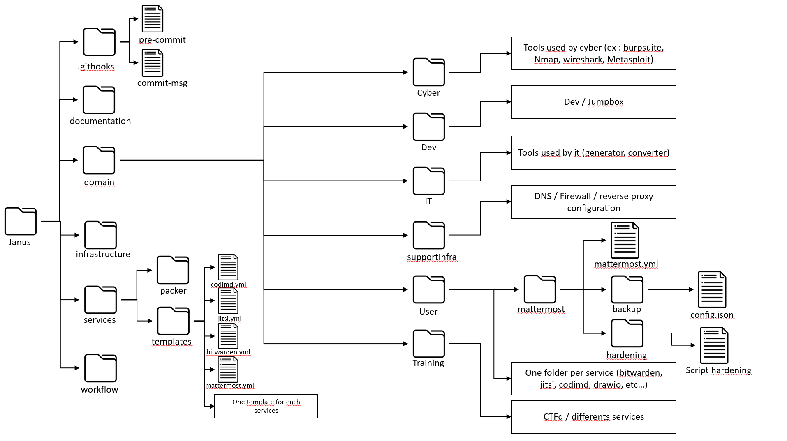

# Rules : [HERE](reporting/project_management/Rules-for-Janus-project.md)

# Table of content

[[_TOC_]]

# The Private Cloud fully as IaC/CaC secure & private by design that can also be deployed as a target range for cyber security oriented training

The purpose of this project is to create a fully automated private cloud, including

- user service environment
- user desktop environment
- it tools environment
- cyber tools environment
- learning environment

in such a fashion that a change in settings would allow to use it as a target cyber range for cyber related training or table top exercize simulation/serious games.



# Project lead & copyright Jérôme Dossogne all rights reserved

# How to launch the project
To properly run the project, the following dependencies must be downloaded and installed on the local machine of the user:

> Note: Repository update (`apt update -y`) may be required before running the commands 

- Virtualbox: The local version of the project runs only on virtualbox.
```sh
apt install virtualbox
```

- Hashicorp vagrant: Required to execute vagrant command on the user machine.
 ```sh
apt install vagrant
```


After the installation of the dependencies, users can deploy the user domain by navigating to the directory ```janus/domain/user``` to execute the following command

```sh
vagrant destroy --force && vagrant box update && vagrant up
```

## To enable CyFun compliance features (asset inventory, vulnerability scan, etc.)

Navigate to the user domain directory:

```sh
cd janus/domain/user
```

Use the environment variable `USE_CYFUN=true` **before** the launch:

* On **Linux/macOS**:

```sh
USE_CYFUN=true vagrant destroy --force && vagrant box update && vagrant up
```

* On **Windows** (CMD):

```cmd
set "USE_CYFUN=true" && vagrant destroy --force && vagrant box update && vagrant up
```

* On **Windows** (PowerShell):

```cmd
$env:USE_CYFUN="true"
vagrant destroy --force
vagrant box update
vagrant up
```

# Contributors
## Project lead
- JD

## Current contributors
- DE SOUSA BARROS LEAL Mendo
- Bakhat Ilyas
- QUERINJEAN Arnaud
(add yourself here if you want to be remembered :))

## Past contributors
- LUYCKX Marco
- BRUYERE Mathis
- DELVIGNE Antoine

---

# Current contributors' main focus
- DE SOUSA BARROS LEAL Mendo: Focus on social engineering attacks and the creation of a cybersecurity training framework & platform to prevent attacks.
- QUERINJEAN Arnaud: Designing a cyber-secure IT infrastructure for accounting firms in Belgium using EaC, TDD, and CI/CD, aligned with the CyFun framework.

This section should allow for a very short, very quick overview and understanding of every current contributor's objective.

- Find the weekly work organization of each member [here](reporting/project_management/weekly_work_organization/)
- Find the pomodoro [here](https://docs.google.com/spreadsheets/d/16nG3G4i6YsK1znzWkhqAAuyKqIjlsNxo/edit#gid=64304003)

# Project convention naming

In order to respect the convention naming, please read this [README](.githooks/README.md) and follow the instructions

# Tools

You have to be familiar with some tools and keywords, please read this [README](documentation/tools/README.md)

# Domains

To see which service is available on each domain read [this](domain/README.md)

# List of potential WP to show the direction
- Each WP has a set of objectives
  collapsed:: true
  - Project Management PDCA
    - Define
      - WPs
      - Milestones
      - RACI
      - KPI
      - SMART
      - User stories
      - etc.
      - plafinification
      - priority
      - integrate with PM
    - Validate definitions
      - Self
        - Against checklist methodologies, objectives, philosphy, features, etc.
      - Report & get approval
    - Schedule
    - Deliver Release
      - Document
      - Demo
      - Handover
      - Ensure "appropriated" by others, integrated, used etc. (deliver your pizza, ensure they eat and like it)
      - Report
        - Measurement, successes, KPI, etc.
    - Adapt
  - Features
    - Specific to each
  - Automation
    - pipeline CI/CD
    - hardening
    - testing
    - PICERL / NIST CSF
      - Monitoring
      - Measurements
      - Alerting
      - Detection
- WP0: get familiar 2 weeks
  collapsed:: true
  - philosophy
  - project
  - technologies
  - procedures
  - see keywords
- WP1: define virtual organization
  collapsed:: true
  - rules
  - organigram
    - roles
  - processes
  - tools
    - "as text"
      - only gdocs (collaborative simultaneous commenting/editing)
- WP2: reset hetzner
  collapsed:: true
  - to debian
  - to debian fde
  - to proxmox
  - to proxmox fde
- WP3: services
  collapsed:: true
  - dev local: vm-> container
  - prod remote: hetzner -> vm -> container
- WP4: infra access control
  collapsed:: true
  - WAF
  - Firewalls
  - ....
- WP5: statefullness & backups
  collapsed:: true
  - feature
    - systems are now statefull
      - messages on mattermost are kept between deployment & backuped at scheduled interval
  - automation
    - pipeline ci/CD
    - hardening
    - testing
- WP6: cyber departement env
- WP7: IT dep env
  collapsed:: true
  - DNS, ...
  - Monitoring, ...
  - ...
- WP8: learning env ("meta")
  - Tools for players in the range or users to learn
  - Could be kms, could be to discuss, exchange files, ...
  - Use case: you play in a cyberrange, you end up using discord, shared terminal, ngrok, google docs etc. with your teammates.
- WP9: gamification
- WP10: unattended baremetal usb local deployment (3rd mode)
- WP11: Automated Content Generator (static)
  collapsed:: true
  - Organization
  - Messages
  - Documents
  - ...
- WP12: Automated User simulation (dynamic)
- WP13: Automated Attacker simulation (dynamic)
- WP14: Monitoring / Dashboarding
  collapsed:: true
  - Beyond the "IT" environment
  - Simplified control, alerting, etc.
  - Use cases
    - CTF with an instructor, only need to know it doesn't work anymore and reset/reboot etc.
- WP15: User environments
  collapsed:: true
  - Desktops etc.
  - Per profile
    - Hardened/vulnerable
    - Work/Home-Family-Media-Gaming/Banking/...
    - Multi OS
    - Mobile - Desktop ...
- WP16: IoT
  - Introduce IoT systems in the range
  - Virtualized and/or physical
- WP17: Meta services
  - Services that could be shared/used in the background by any routine/script
  - LLMs, ... ?
- WP18: Optimizations
  - Extra runners
  - Portability (rpi?)
- WP19: deploy containers cloud only (4th deployment mode)
- WP20: Secure Software Dev DevSecOps custom services
- WP21: CyberDeception
- WP22: Continuous Automated Compliance Framework X
- WP23: Implementation Framework X (NIST CSF, Mitre Defend/Attack/Engage,...)
